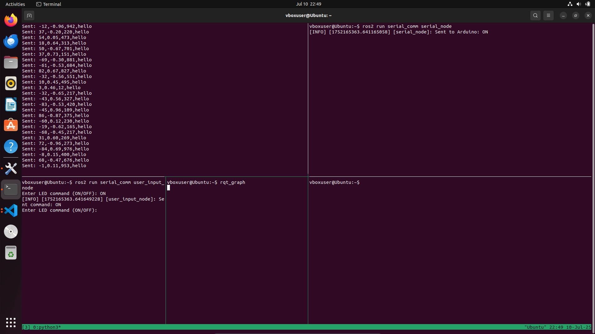

````markdown
````
## Documentation

---
## 1. Workspace Setup
```bash
mkdir -p ~/ros2_ws_CS/src
cd ~/ros2_ws_CS/src
```
## 2. Create Your Packages

```bash
ros2 pkg create --build-type ament_python basic_comm
ros2 pkg create --build-type ament_python serial_comm
ros2 pkg create --build-type ament_python inverse_kinematics
```

---

## 3. Build Workspace

```bash
cd ~/ros2_ws_CS
colcon build
source install/setup.bash
```

> **Note:**
>
> * After any code or package changes, run `colcon build` again.
> * Before running ROS2 nodes in any terminal, run:
>
>   ```bash
>   source install/setup.bash
>   ```
> * To automate sourcing on every new terminal, add this line to your `~/.bashrc`:
>
>   ```bash
>   echo "source ~/ros2_ws_CS/install/setup.bash" >> ~/.bashrc
>   ```

---

## Checking Serial Ports (for Arduino)

To list available serial ports:

```bash
dmesg | grep tty
```

or

```bash
ls /dev/tty*
```

> In a simulated environment, serial communication can be skipped and data can be manually published. See **Task C6** for simulation instructions.

---

# Tasks Overview

---

## Task C1: Basic Communication

### Description

* Create two ROS2 nodes:

  1. **Talker:** Reads user input (string) and publishes to a topic.
     Location: `basic_comm/basic_comm/talker.py`
     Run command:

     ```bash
     ros2 run basic_comm talker
     ```
  2. **Listener:** Subscribes to the topic and prints received messages.
     Location: `basic_comm/basic_comm/listener.py`
     Run command:

     ```bash
     ros2 run basic_comm listener
     ```

### Testing

Type a message in the talker terminal and observe it appear in the listener terminal.

---

## Task C2: Serial Communication

### Arduino Code

* Simulates sensor data.
* Listens for LED on/off commands.

### ROS2 Nodes

* `serial_comm/serial_comm/serial_node.py`: Interfaces with Arduino.
* `serial_comm/serial_comm/user_input_node.py`: Sends LED toggle commands.

### Serial Data Format

Data sent from Arduino:

```
valueA,valueB,valueC,valueD\n
```

| Value | Type    | Range       | Notes        |
| ----- | ------- | ----------- | ------------ |
| A     | Integer | -100 to 100 |              |
| B     | Float   | -1.0 to 1.0 |              |
| C     | Integer | 0 to 1023   |              |
| D     | String  | "hello"     | Fixed string |

### Published Topics

| Topic                  | Message Type |
| ---------------------- | ------------ |
| `/sensor_data/value_a` | `Int64`      |
| `/sensor_data/value_b` | `Float64`    |
| `/sensor_data/value_c` | `Int64`      |
| `/sensor_data/value_d` | `String`     |

### Running

```bash
ros2 run serial_comm serial_node
ros2 run serial_comm user_input_node
```

---


---

## Task C3: Inverse Kinematics

### Goal

Given a target coordinate `(x, y)`, calculate the joint angles (`theta1`, `theta2`) of a 2DOF robotic arm to reach that point and publish them.

### Parameters

* `L1 = 14.0` cm (first arm segment length)
* `L2 = 15.5` cm (second arm segment length)

### IK Formulas

1. Calculate distance `d` to the target:

   $$
   d = \sqrt{x^2 + y^2}
   $$

2. Check reachability:

   ```
   if d > L1 + L2 or d < |L1 - L2|:
       error("Target is out of reach")
   ```

3. Calculate elbow angle (`theta2`):

   $$
   \phi = \arccos\left(\frac{L_1^2 + L_2^2 - d^2}{2 L_1 L_2}\right)
   $$

   $$
   \theta_2 = \text{degrees}(\pi - \phi)
   $$

4. Calculate shoulder angle (`theta1`):

   $$
   \beta = \arccos\left(\frac{L_1^2 + d^2 - L_2^2}{2 L_1 d}\right)
   $$

   $$
   \alpha = \arctan2(y, x)
   $$

   $$
   \theta_1 = \text{degrees}(\alpha - \beta)
   $$

### Running the Node

```bash
ros2 run inverse_kinematics ik_node
```

### Testing

Publish a target position:

```bash
ros2 topic pub /miniarm/target geometry_msgs/msg/Vector3 '{x: 10.0, y: 20.0, z: 0.0}'
```

---


---

## Task C4: Launch File + Logger Node

### Logger Node

* Subscribes to sensor topics and prints their values.

* Location: `serial_comm/logger_node.py`

### Launch File

* Location: `serial_comm/launch/system_launch.py`

```python
from launch import LaunchDescription
from launch_ros.actions import Node

def generate_launch_description():
    return LaunchDescription([
        Node(package='serial_comm', executable='serial_node', name='serial_node'),
        Node(package='serial_comm', executable='user_input_node', name='user_input_node'),
        Node(package='serial_comm', executable='logger_node', name='logger_node'),
    ])
```

### Run all nodes with

```bash
ros2 launch serial_comm system_launch.py
```

---


---

## Task C5: Forward Kinematics

### Goal

* Subscribe to `/miniarm/angles` (joint angles).
* Calculate and print the end-effector position `(x, y)`.

### Formulas

Given angles in degrees: `theta1`, `theta2`

$$
\begin{aligned}
x_1 &= L_1 \cos(\theta_1) \\
y_1 &= L_1 \sin(\theta_1) \\
x_2 &= x_1 + L_2 \cos(\theta_1 + \theta_2) \\
y_2 &= y_1 + L_2 \sin(\theta_1 + \theta_2)
\end{aligned}
$$

### Run the Node

```bash
ros2 run inverse_kinematics fk_node
```

### Testing

Publish angles:

```bash
ros2 topic pub /miniarm/angles geometry_msgs/msg/Vector3 '{x: 90.0, y: 0.0, z: 0.0}'
```

Expected output:

```
x = 0.00, y = 29.5
```

---


---

## Task C6: Demo Run without Real Arduino

To test serial communication without a physical Arduino:

1. Run socat to create virtual serial ports:

```bash
socat -d -d PTY,raw,echo=0 PTY,raw,echo=0
```

* This will print two port names (e.g., `/dev/pts/3` and `/dev/pts/4`).

2. Configure `sample_arduino.py` with one of the ports for simulated Arduino serial communication.

3. Run `sample_arduino.py` to simulate Arduino behavior.

---

# Screenshots(Terminal)

---





